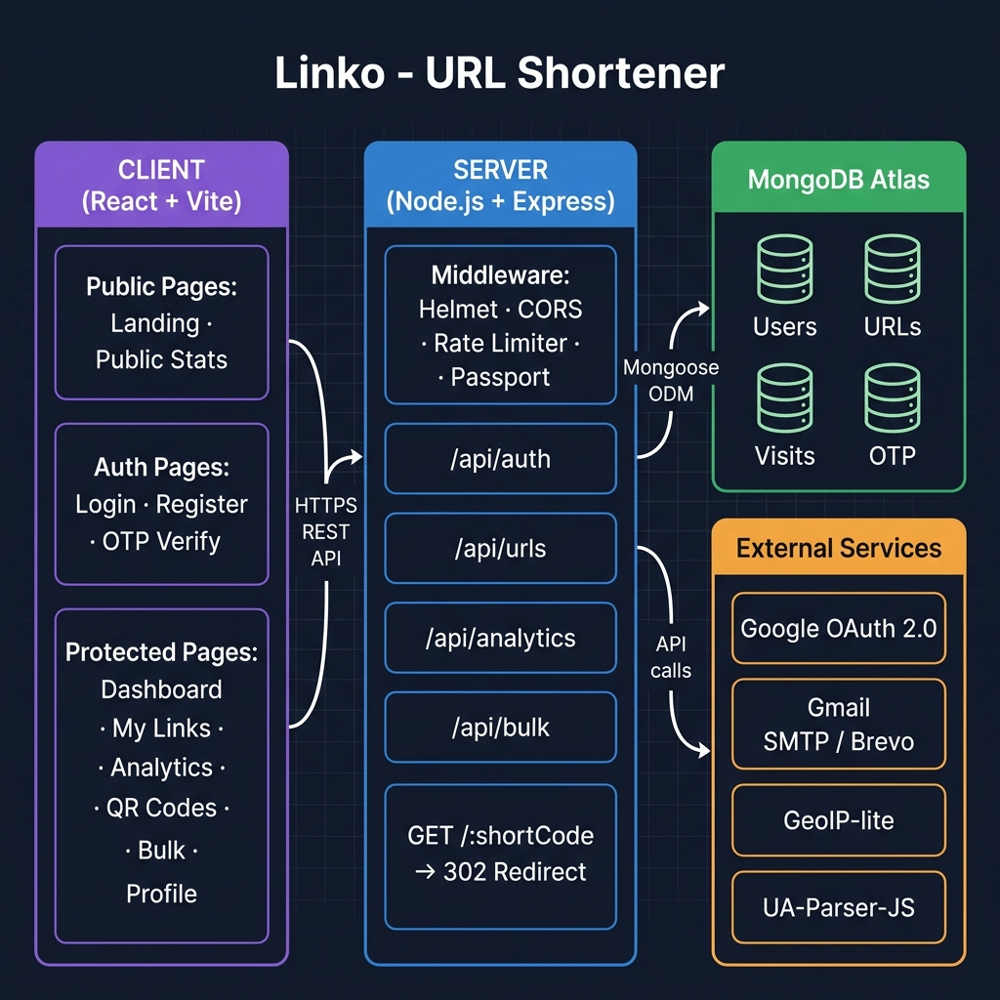

# 🔗 Linko – URL Shortener & Analytics Platform

> **Shorten. Track. Analyze.**

Linko is a modern, full-stack URL Shortener and Analytics platform built with **React, Node.js, Express, and MongoDB**. It allows users to create branded short links, track engagement through real-time analytics, generate QR codes, manage custom aliases, monitor visitor behaviour, and gain valuable insights through a clean SaaS-style dashboard.

---

## 📺 Demo Video

▶️ **[Watch the full demo on Loom](https://www.loom.com/share/c77a71d1667a45e0b36fc8f64c91fc1e)**

> A complete walkthrough of all features: authentication, URL shortening, analytics, QR codes, bulk upload, and more.

---

## 📸 Features Overview

| Feature | Description |
|---|---|
| 🔐 Authentication | Email/Password + Google OAuth + OTP Verification |
| 🔗 URL Shortening | Convert long URLs into short, shareable links |
| 🎯 Custom Aliases | Branded links like `linko.io/my-portfolio` |
| ⏰ Expiry Links | Set expiration dates for any link |
| 📱 QR Code Generation | Download QR codes as PNG or SVG |
| 📊 Analytics Dashboard | Clicks, devices, browsers, countries, referrers |
| 📜 Visit History | Per-click tracking with full metadata |
| 🌎 Public Stats Page | Shareable analytics page (no login required) |
| 📂 Bulk URL Shortening | Upload CSV and batch-shorten hundreds of URLs |
| 👤 Profile Management | Update name, email, password, timezone |

---

## 🚀 Setup Instructions

### Prerequisites

Before you begin, ensure you have the following installed:

- **Node.js** ≥ 18 — [Download](https://nodejs.org/)
- **npm** ≥ 9 (comes with Node.js)
- **MongoDB Atlas account** — [Sign up free](https://www.mongodb.com/atlas)
- **Google Cloud Console project** (for OAuth) — [Create one](https://console.cloud.google.com/)
- **Gmail account** (for OTP emails via App Password)

---

### 1. Clone the Repository

```bash
git clone https://github.com/Kavincodeg/url-shortener.git
cd url-shortener
```

---

### 2. Set Up the Backend (Server)

```bash
cd server
npm install
```

#### Create your `.env` file

Copy the example file and fill in your credentials:

```bash
cp .env.example .env
```

Open `server/.env` and configure the following variables:

```env
# Server
PORT=5000
NODE_ENV=development

# MongoDB Atlas
MONGO_URI=mongodb+srv://<username>:<password>@<cluster>.mongodb.net/<dbname>?retryWrites=true&appName=url

# JWT
JWT_SECRET=your_super_secret_jwt_key_here
JWT_EXPIRE=7d

# URLs
BASE_URL=http://localhost:5000
CLIENT_URL=http://localhost:5173

# Google OAuth
GOOGLE_CLIENT_ID=your_google_client_id_here
GOOGLE_CLIENT_SECRET=your_google_client_secret_here
GOOGLE_REDIRECT_URI=http://localhost:5000/api/auth/google/callback

# Email OTP (Gmail SMTP)
GMAIL_USER=your.email@gmail.com
GMAIL_APP_PASSWORD=xxxx xxxx xxxx xxxx

# Optional: Brevo / Resend / SendGrid (HTTP-based email API)
# BREVO_API_KEY=your_brevo_api_key_here
# RESEND_API_KEY=your_resend_api_key_here
```

> **How to get a Gmail App Password:**
> Go to [myaccount.google.com/apppasswords](https://myaccount.google.com/apppasswords), create an app password for "Mail", and paste the 16-character code as `GMAIL_APP_PASSWORD`.

#### Start the backend server

```bash
# Development (with hot reload)
npm run dev

# Production
npm start
```

The server will start at: **http://localhost:5000**

---

### 3. Set Up the Frontend (Client)

Open a new terminal:

```bash
cd client
npm install
```

#### Configure environment (optional for local dev)

The client is pre-configured to point to `http://localhost:5000` in development. No `.env` changes are needed unless your server runs on a different port.

For production, update `client/.env.production`:

```env
VITE_API_URL=https://your-backend-domain.com
```

#### Start the frontend dev server

```bash
npm run dev
```

The app will be available at: **http://localhost:5173**

---

### 4. Google OAuth Setup

1. Go to [Google Cloud Console](https://console.cloud.google.com/) → **APIs & Services** → **Credentials**
2. Create an **OAuth 2.0 Client ID** (Web application)
3. Add Authorized redirect URI: `http://localhost:5000/api/auth/google/callback`
4. Copy **Client ID** and **Client Secret** into your `server/.env`

---

### 5. MongoDB Atlas Setup

1. Create a free cluster at [mongodb.com/atlas](https://www.mongodb.com/atlas)
2. Add a database user and whitelist your IP (or allow all: `0.0.0.0/0`)
3. Copy the connection string into `MONGO_URI` in `server/.env`
4. The database and collections are created automatically on first run

---

### 6. Verify Everything Works

Open your browser and navigate to:

- Frontend: [http://localhost:5173](http://localhost:5173) — You should see the Linko landing page
- Backend health check: [http://localhost:5000/api/health](http://localhost:5000/api/health) — Should return `{ "success": true }`

---

## 🌐 Deployment

| Layer | Recommended Platform |
|---|---|
| Frontend | Vercel / Netlify |
| Backend | Render / Railway / Fly.io |
| Database | MongoDB Atlas |

### Deploy Frontend to Vercel

```bash
cd client
npm run build
# Push to GitHub, then connect repo to Vercel
```

### Deploy Backend to Render

Use the included `render.yaml` at the project root for one-click deployment.
Set all environment variables from `server/.env.example` in the Render dashboard.

---

## 🧠 AI Planning Document

### Problem Statement

Users need a simple, reliable way to shorten long URLs, share them, and understand how those links are being used — without being dependent on proprietary platforms like bit.ly that have usage limits or paywalls for analytics.

### Planning Approach

The application was planned with an AI-assisted approach using the following process:

1. **Requirements Decomposition** — Broke down the hackathon prompt into atomic features: shorten, authenticate, track, analyse, bulk process.
2. **Schema Design First** — Defined MongoDB schemas before writing any controller logic to avoid rework.
3. **API Contract Definition** — Planned all REST endpoints and their request/response shapes before implementation.
4. **Progressive Enhancement** — Started with core shortening + redirect, then layered in auth, analytics, QR, and bulk upload.
5. **Security-First Middleware** — Rate limiting, Helmet, CORS, and input validation were planned as cross-cutting concerns, not afterthoughts.

### Key Design Decisions

| Decision | Rationale |
|---|---|
| MongoDB over SQL | Flexible document model suits visit-log writes at scale |
| nanoid for short codes | Collision-resistant, URL-safe, and compact |
| JWT + Passport sessions | JWT for API auth; Passport session for OAuth callback flow |
| GeoIP-lite (offline) | No external API call per redirect; fast lookup from bundled DB |
| Soft deletes (`isDeleted`) | Preserve analytics data even after a user deletes a link |
| Custom alias as sparse index | Prevents duplicate aliases while allowing multiple null values |

---

## 🏗️ Architecture Diagram



| Layer | Technology | Role |
|---|---|---|
| **Client** | React + Vite | SPA served from Vercel/Netlify |
| **Transport** | HTTPS REST API | JSON over HTTP between client and server |
| **Server** | Node.js + Express | API routes, auth, redirect logic |
| **Database** | MongoDB Atlas | Stores Users, URLs, Visits, OTPs |
| **Auth** | Passport.js + JWT | Local + Google OAuth 2.0 |
| **Email** | Gmail SMTP / Brevo | OTP delivery |
| **Geo / UA** | GeoIP-lite + UA-Parser | Location & device analytics |

### Data Flow: URL Redirect

1. User clicks a short link (e.g. `linko.io/abc123`)
2. Express receives `GET /:shortCode`
3. **Rate limiter** checks request frequency
4. MongoDB lookup by `shortCode` or `customAlias`
5. **Expiry check** — if expired, return `410 Gone`
6. **UA-Parser** extracts device, browser, OS from User-Agent header
7. **GeoIP-lite** resolves IP address to country and city
8. Visit document written to MongoDB (async, non-blocking)
9. `totalClicks` counter incremented (async)
10. Server returns **HTTP 302** → redirects user to `originalUrl`

---

## 📂 Project Structure

```
url-shortener/
│
├── client/                        # React + Vite frontend
│   ├── src/
│   │   ├── pages/                 # Route-level page components
│   │   │   ├── LandingPage.jsx
│   │   │   ├── LoginPage.jsx
│   │   │   ├── RegisterPage.jsx
│   │   │   ├── OTPPage.jsx
│   │   │   ├── DashboardPage.jsx
│   │   │   ├── MyLinksPage.jsx
│   │   │   ├── AnalyticsPage.jsx
│   │   │   ├── AnalyticsOverviewPage.jsx
│   │   │   ├── VisitHistoryPage.jsx
│   │   │   ├── QRCodesPage.jsx
│   │   │   ├── BulkPage.jsx
│   │   │   ├── ProfilePage.jsx
│   │   │   ├── PublicStatsPage.jsx
│   │   │   └── BillingPage.jsx
│   │   ├── components/            # Reusable UI components
│   │   ├── context/               # AuthContext, ThemeContext
│   │   ├── lib/                   # Utility helpers (urlHelper.js)
│   │   └── App.jsx                # Root routing
│   ├── index.html
│   └── vite.config.js
│
├── server/                        # Node.js + Express backend
│   └── src/
│       ├── config/                # DB connection, Passport config
│       ├── controllers/           # Business logic
│       │   ├── authController.js
│       │   ├── urlController.js
│       │   ├── analyticsController.js
│       │   ├── bulkController.js
│       │   └── redirectController.js
│       ├── middleware/            # Auth, rate limiter, error handler
│       ├── models/                # Mongoose schemas
│       │   ├── User.js
│       │   ├── Url.js
│       │   ├── Visit.js
│       │   └── OTP.js
│       ├── routes/                # Express route definitions
│       ├── services/              # Email service abstraction
│       ├── utils/                 # nanoid, QR code helpers
│       └── index.js               # App entry point
│
├── render.yaml                    # Render.com deployment config
├── .gitignore
└── README.md
```

---

## 🗄️ Database Schema

### Users Collection

```javascript
{
  _id: ObjectId,
  name: String,
  email: String (unique),
  password: String (hashed, bcrypt),
  provider: String,        // 'local' | 'google'
  googleId: String,
  avatar: String,
  timezone: String,
  isVerified: Boolean,
  createdAt: Date,
  updatedAt: Date
}
```

### URLs Collection

```javascript
{
  _id: ObjectId,
  userId: ObjectId (ref: User),
  originalUrl: String,
  shortCode: String (unique),
  customAlias: String (unique, sparse),
  totalClicks: Number,
  expiresAt: Date | null,
  password: String | null,
  qrCode: String (base64),
  isDeleted: Boolean,       // Soft delete
  createdAt: Date,
  updatedAt: Date
}
```

### Visits Collection

```javascript
{
  _id: ObjectId,
  urlId: ObjectId (ref: Url),
  timestamp: Date,
  ip: String,
  browser: String,
  os: String,
  device: String,
  country: String,
  city: String,
  referrer: String
}
```

### OTP Collection

```javascript
{
  _id: ObjectId,
  email: String,
  otp: String (hashed),
  expiresAt: Date,
  createdAt: Date
}
```

---

## 🔌 REST API Reference

### Authentication — `/api/auth`

| Method | Endpoint | Description | Auth Required |
|---|---|---|---|
| POST | `/register` | Register new user | No |
| POST | `/login` | Login with email/password | No |
| POST | `/send-otp` | Send OTP to email | No |
| POST | `/verify-otp` | Verify OTP code | No |
| GET | `/me` | Get current user profile | Yes |
| PUT | `/me` | Update profile | Yes |
| PUT | `/me/password` | Change password | Yes |
| GET | `/google` | Initiate Google OAuth | No |
| GET | `/google/callback` | Google OAuth callback | No |
| POST | `/logout` | Logout | Yes |

### URLs — `/api/urls`

| Method | Endpoint | Description | Auth Required |
|---|---|---|---|
| POST | `/` | Create short URL | Yes |
| GET | `/` | List user's URLs | Yes |
| GET | `/:id` | Get single URL | Yes |
| PUT | `/:id` | Update URL | Yes |
| DELETE | `/:id` | Soft-delete URL | Yes |

### Analytics — `/api/analytics`

| Method | Endpoint | Description | Auth Required |
|---|---|---|---|
| GET | `/:id` | Get analytics for a URL | Yes |
| GET | `/:id/visits` | Paginated visit history | Yes |
| GET | `/public/:shortCode` | Public stats | No |

### Bulk — `/api/bulk`

| Method | Endpoint | Description | Auth Required |
|---|---|---|---|
| POST | `/` | Upload CSV and bulk-shorten | Yes |

### Redirect

| Method | Endpoint | Description |
|---|---|---|
| GET | `/:shortCode` | Redirect to original URL |

---

## ⚙️ Assumptions Made

1. **Single-tenant by default** — Each user owns their own links; no team/org sharing is implemented.
2. **No payment processing** — The Billing page is a UI placeholder; no real payment gateway is integrated.
3. **GeoIP accuracy** — Location data uses the bundled `geoip-lite` database, which is accurate to country/city level but may lag behind real-time changes.
4. **Short code collisions are negligible** — `nanoid` with 8 characters gives ~281 trillion combinations; collision probability is effectively zero at small scale.
5. **CSV bulk upload format** — One URL per line, no header row required. The system skips invalid/empty lines gracefully.
6. **OTP expiry is 10 minutes** — Standard security window; users should request a new OTP if it expires.
7. **Email deliverability** — Gmail SMTP may have sending limits in production; Brevo/Resend is the recommended alternative for higher volume.
8. **Short codes and aliases are case-insensitive** — All aliases are stored and matched in lowercase.
9. **Soft deletes preserve analytics** — Deleted links are flagged `isDeleted: true` but visits remain queryable for data integrity.
10. **The `BASE_URL` env var controls the redirect domain** — In production, this should be your custom domain (e.g., `https://linko.io`).

---

## 🔒 Security Features

- ✅ JWT-based stateless authentication
- ✅ Password hashing with bcrypt (10 rounds)
- ✅ Google OAuth 2.0 via Passport.js
- ✅ OTP verification for email sign-up
- ✅ Express rate limiting (general + redirect-specific)
- ✅ Helmet.js security headers
- ✅ CORS restricted to configured client origin
- ✅ Input validation via express-validator
- ✅ Ownership-based authorization (users can only modify their own links)
- ✅ Soft deletes — no hard data loss
- ✅ Centralized error handling middleware

---

## 🌟 Tech Stack

### Frontend
| Technology | Version | Purpose |
|---|---|---|
| React.js | 18.x | UI framework |
| Vite | 5.x | Build tool & dev server |
| React Router DOM | 6.x | Client-side routing |
| Tailwind CSS | 3.x | Utility-first styling |
| Axios | 1.x | HTTP client |
| Recharts | 2.x | Analytics charts |
| Lucide React | 0.469 | Icon library |
| React Hot Toast | 2.x | Toast notifications |
| React Dropzone | 14.x | CSV file uploads |

### Backend
| Technology | Version | Purpose |
|---|---|---|
| Node.js | ≥ 18 | Runtime |
| Express.js | 5.x | Web framework |
| MongoDB | Atlas | Database |
| Mongoose | 9.x | ODM |
| JWT | 9.x | Authentication tokens |
| bcryptjs | 3.x | Password hashing |
| Passport.js | 0.7 | OAuth strategy |
| nanoid | 3.x | Short code generation |
| qrcode | 1.x | QR code generation |
| geoip-lite | 2.x | IP geolocation |
| ua-parser-js | 2.x | User-agent parsing |
| Helmet | 8.x | Security headers |
| express-rate-limit | 8.x | Rate limiting |
| nodemailer | 8.x | Email delivery |
| multer | 2.x | File upload handling |
| csv-parser | 3.x | CSV processing |

---

## 🔮 Future Enhancements

- 🔲 Team Collaboration & Workspaces
- 🔲 Custom Domain Support
- 🔲 UTM Parameter Builder
- 🔲 Campaign Tracking
- 🔲 AI-Powered Link Insights
- 🔲 Scheduled Email Reports
- 🔲 Webhook Integrations
- 🔲 Link A/B Testing
- 🔲 Advanced Marketing Dashboard
- 🔲 Mobile App (React Native)

---

## 👨‍💻 Author

Built as a modern SaaS-grade URL management and analytics platform for the Katomaran Hackathon.

**Linko** — *Shorten. Track. Analyze.*

---

> This project is a part of a hackathon run by https://katomaran.com
